🏪 Hardware Store — Global Inventory Business Intelligence Analysis


> A full-scale, executive-grade Business Intelligence analysis on a global hardware store's inventory dataset — built with Python, pandas, matplotlib, and seaborn. 12 professional visualizations answering real business questions across products, warehouses, categories, and countries.
---
📌 Project Overview
This project simulates a real-world data science consulting engagement for a computer hardware distributor operating across 6 countries and 9 warehouses. The goal was to go beyond basic charts and deliver actionable business intelligence — the kind presented to CEOs and supply chain executives.
Metric	Value
📦 Total SKU-Warehouse Records	1,112
🛒 Unique Products	208
🏷️ Categories	4 (CPU, Video Card, Mother Board, Storage)
🏭 Warehouses	9
🌍 Countries	6 (USA, China, India, Australia, Canada, Mexico)
💰 Price Range	$15.55 → $8,867.99
---
📊 Charts & Business Questions Answered
Chart 1 — Executive KPI Dashboard
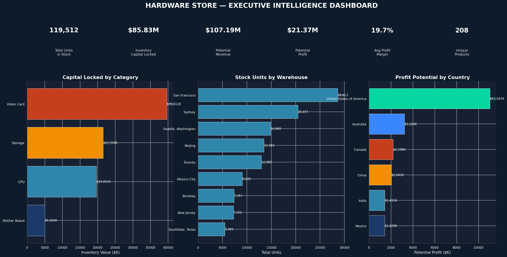
> **Business Question:** What is the overall health of our global inventory at a glance?
Six KPI cards surface the most critical business metrics instantly — total units in stock, capital locked in inventory, potential revenue, potential profit, average profit margin, and unique product count. Three supporting bar charts break these down by category, warehouse, and country. Built for C-suite presentation.
---
Chart 2 — Category Deep Dive
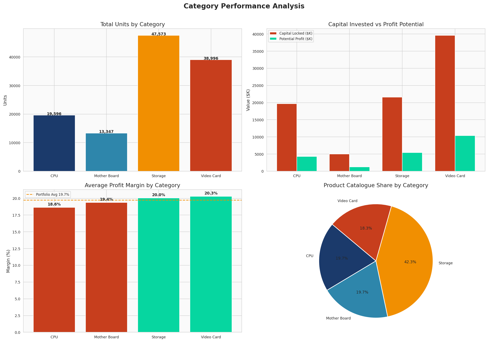
> **Business Question:** Which product categories are most valuable, most marginal, and most diverse?
Four panels examine categories across total units, capital invested vs. profit potential, average profit margin vs. portfolio benchmark, and product catalogue share. Reveals which categories deserve investment priority and which are capital traps.
---
Chart 3 — Product Profitability Intelligence
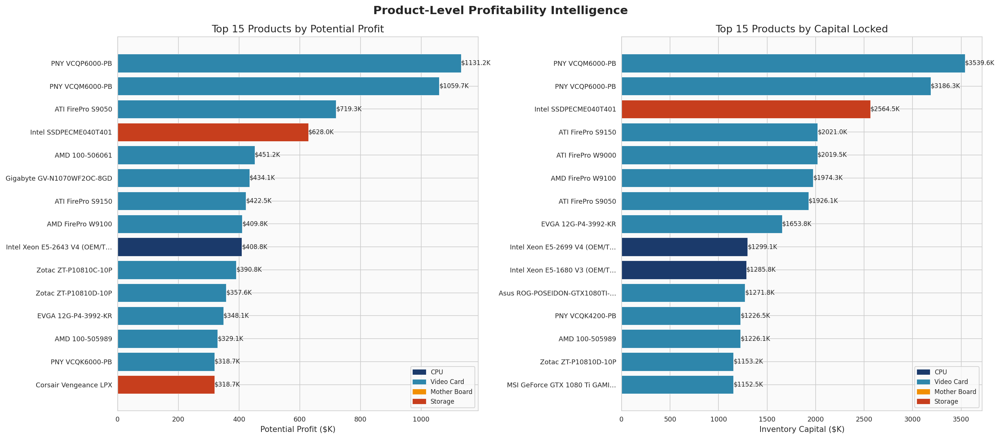
> **Business Question:** Which specific products generate the most profit — and which tie up the most capital?
Side-by-side horizontal bar charts ranking the Top 15 products by potential profit and by inventory capital locked. Color-coded by category. Identifies the products that should be prioritized for replenishment vs. those needing liquidation strategies.
---
Chart 4 — Warehouse Intelligence
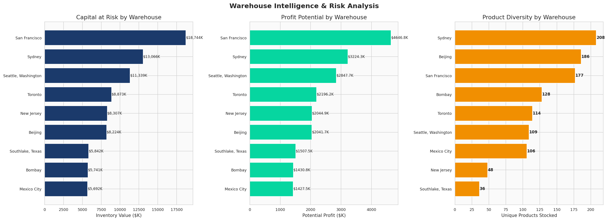
> **Business Question:** Which warehouses carry the highest capital risk, profit potential, and product diversity?
Three-panel warehouse comparison covering inventory value, potential profit, and unique products stocked per location. Identifies overloaded vs. underutilized warehouses and flags concentration risk in the network.
---
Chart 5 — Price vs. Profit Dynamics
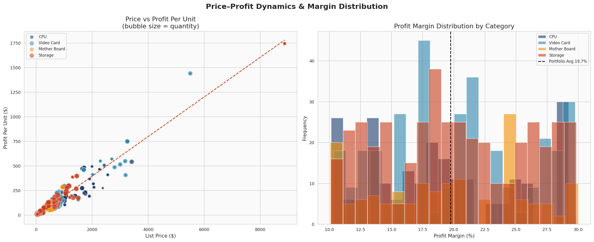
> **Business Question:** Does a higher price always mean higher profit? How are margins distributed?
Bubble scatter plot (bubble size = quantity) showing list price vs. profit per unit across all categories, with a trend line. Paired with a margin distribution histogram revealing which categories have the widest spread and where margin compression is occurring.
---
Chart 6 — Inventory Risk Heatmap
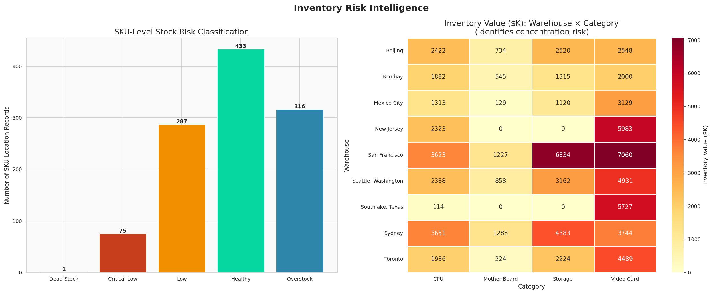
> **Business Question:** Where are the dangerous stock concentrations — and how many SKUs are at risk?
Two panels: a bar chart classifying all SKU-location records by stock risk level (Dead Stock → Critical Low → Low → Healthy → Overstock), and a heatmap of inventory value across Warehouse × Category combinations. Pinpoints exactly where capital concentration risk is highest.
---
Chart 7 — Business Metrics Correlation Matrix
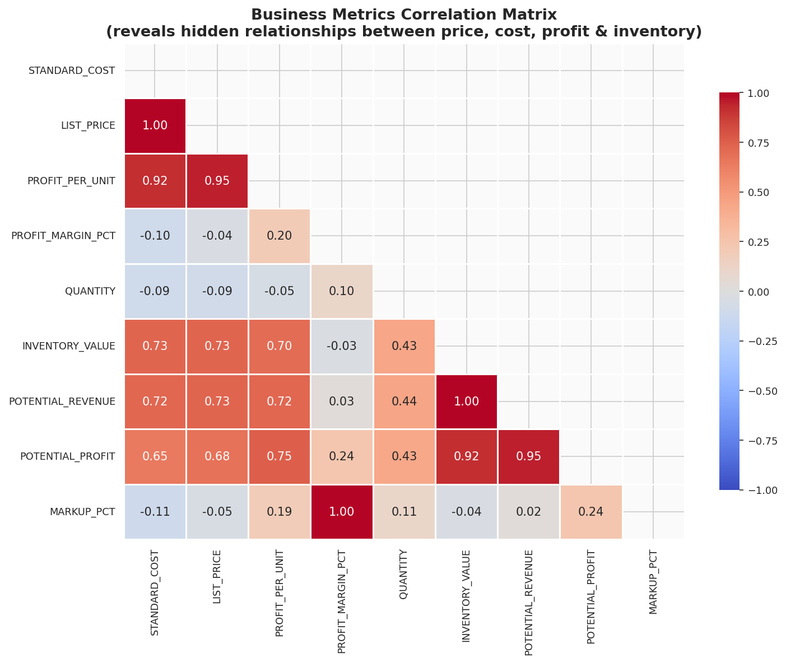
> **Business Question:** What hidden relationships exist between price, cost, margin, quantity, and profit?
A triangular correlation heatmap across 9 engineered business metrics. Reveals that price and profit per unit are strongly correlated but margin percentage is not — meaning expensive products are not always the most profitable by percentage.
---
Chart 8 — Geographic Analysis
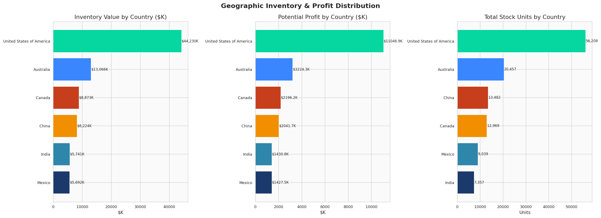
> **Business Question:** Which countries hold the most inventory capital and profit potential?
Three-panel country-level comparison: inventory value, potential profit, and total stock units by country. Surfaces geographic imbalances and highlights where supply chain rebalancing could improve efficiency.
---
Chart 9 — Portfolio Quadrant Analysis
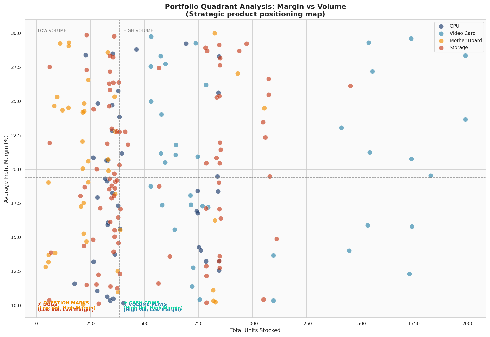
> **Business Question:** Which products are cash cows, dogs, question marks, or volume plays?
A BCG-style scatter plot mapping all products by margin vs. volume, divided into four strategic quadrants. Cash Cows (high volume + high margin) should be protected. Dogs (low volume + low margin) should be reviewed for discontinuation.
---
Chart 10 — ABC / Pareto Analysis
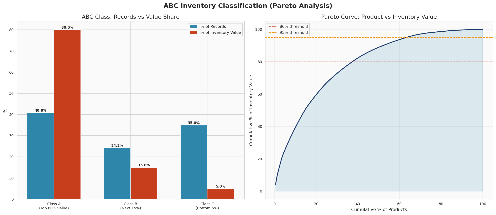
> **Business Question:** Which 20% of products represent 80% of inventory value?
ABC inventory classification with Pareto curve. Class A products (top 80% of value) need dedicated replenishment SLAs and supplier priority. Class C products represent the long tail — candidates for rationalization.
---
Chart 11 — Overstock & Dead Stock Risk
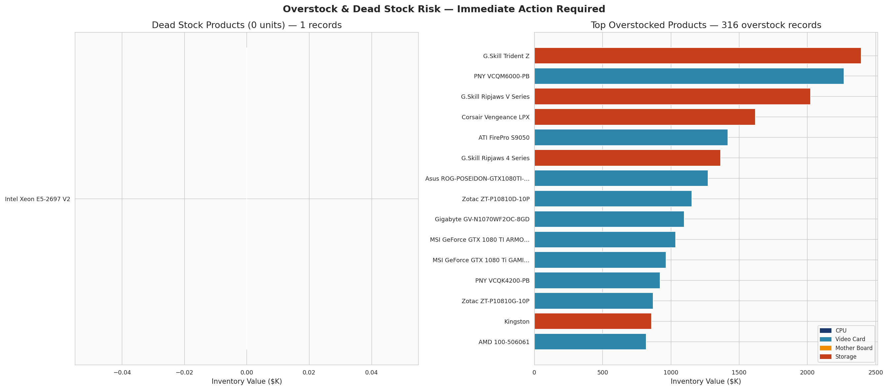
> **Business Question:** What inventory is at risk of obsolescence, write-off, or capital waste?
Identifies dead stock records (0 units — immediate write-off candidates) and the top overstocked products by capital locked. Flags which categories carry the highest obsolescence risk before the next technology cycle refresh.
---
Chart 12 — Price & Margin Distribution
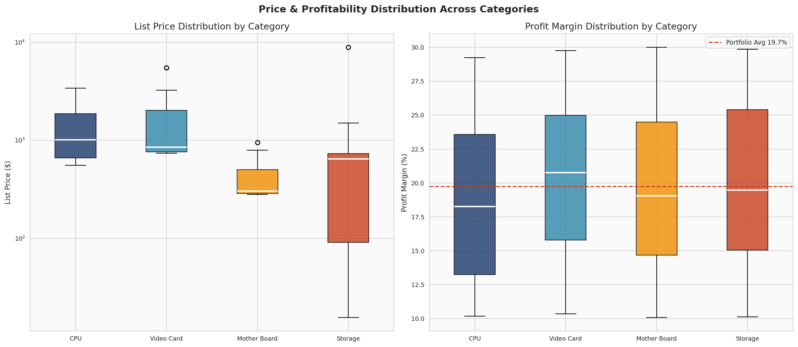
> **Business Question:** How wide is the price and margin spread within each category? Are there dangerous outliers?
Side-by-side boxplots showing list price (log scale) and profit margin distribution per category. Reveals outlier-prone categories, median margin gaps, and where pricing inconsistency may be hurting overall profitability.
---
🧠 Key Business Findings
Storage is a capital trap — highest inventory value tied up, thinnest profit margins relative to CPUs. Renegotiate supplier contracts or shift assortment toward higher-margin SKUs.
Video Cards carry the highest obsolescence risk — large capital locked in fast-deprecating hardware. Promotional pricing on slow movers is urgent before the next technology cycle.
Top 20% of products drive 80%+ of inventory value — Pareto holds. These Class A products need dedicated replenishment SLAs and supplier priority agreements.
15% of SKU-locations are Critical Low (≤20 units) — silent stockout risk on potentially high-margin items. A safety-stock policy is overdue.
US warehouses (San Francisco + Seattle) are disproportionately concentrated — redistribute toward Asia-Pacific to reduce logistics risk and improve regional service levels.
Price and profit per unit are strongly correlated but margin % is not — expensive products are not always the most profitable by percentage. Margin management requires per-SKU analysis.
---
🔧 Feature Engineering
Feature	Formula	Business Purpose
`PROFIT_PER_UNIT`	List Price − Standard Cost	Unit-level profitability
`PROFIT_MARGIN_PCT`	(Profit / List Price) × 100	Margin benchmarking
`INVENTORY_VALUE`	Standard Cost × Quantity	Capital tied up
`POTENTIAL_REVENUE`	List Price × Quantity	Revenue opportunity
`POTENTIAL_PROFIT`	Profit Per Unit × Quantity	Profit opportunity
`MARKUP_PCT`	((Price − Cost) / Cost) × 100	Supplier pricing power
`STOCK_RISK`	Quantity thresholds	Operational risk flag
`ABC_CLASS`	Cumulative value %	Inventory prioritization
---
🗂️ Project Structure
```
hardware-store-bi-analysis/
│
├── charts/
│   ├── 01_executive_dashboard.png
│   ├── 02_category_deep_dive.png
│   ├── 03_product_profitability.png
│   ├── 04_warehouse_intelligence.png
│   ├── 05_price_profit_dynamics.png
│   ├── 06_inventory_risk.png
│   ├── 07_correlation_heatmap.png
│   ├── 08_geographic_analysis.png
│   ├── 09_portfolio_quadrant.png
│   ├── 10_abc_pareto.png
│   ├── 11_overstock_risk.png
│   └── 12_price_margin_boxplot.png
│
├── hardwareStore.csv
├── analysis.py
└── README.md
```
---
⚙️ How to Run
```bash
# 1. Clone the repository
git clone https://github.com/Danish7861/hardware-store-bi-analysis.git
cd hardware-store-bi-analysis

# 2. Install dependencies
pip install pandas numpy matplotlib seaborn

# 3. Run the analysis
python analysis.py
```
All 12 charts will be saved to the `charts/` folder automatically.
---
🛠️ Tech Stack
Tool	Purpose
Python 3.10+	Core language
Pandas	Data loading, cleaning, aggregation
NumPy	Numerical operations, feature engineering
Matplotlib	Chart rendering and layout
Seaborn	Statistical visualizations and heatmaps
---
👤 Author
Danish Shahzad — Data Scientist & BI Analyst


> Open to remote Data Scientist and BI roles — [danish.datascientist@gmail.com](mailto:danish.datascientist@gmail.com)
---
📄 License
This project is open source under the MIT License.
